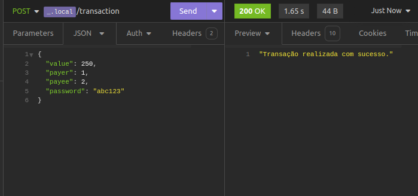
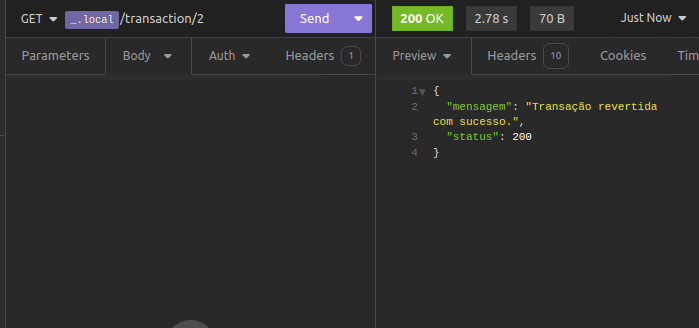
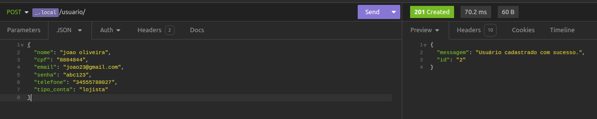
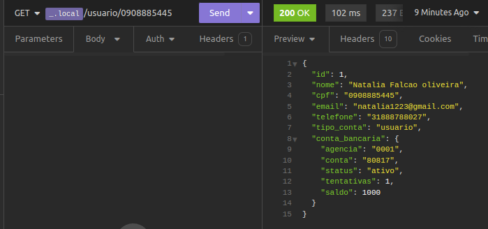

# Projeto Now Transações 🚀

Bem vindo ao Now transações. Um projeto criado com PHP, Laravel, e Postgres. Este projeto foi
feito para aprimorar minhas habilidades com Laravel e PHP, e também para mostrar um pouco do meu
trabalho.

## Descrição ✏️

O projeto foi feito para simular um sistema de transações bancárias. Nele, é possível criar contas, fazer transferencias, criar usuarios comuns e lojistas, além de validar todas as transações antes mesmo de serem feitas.

## Demonstração 🎬

Aqui está algumas demonstrações do projeto:

`/transaction`




`/transaction/:id`



`/usuario`



`/usuario/:cpf`



## Tecnologias e ferramentas utilizadas 🛠️

Para este projeto foram utilizadas as seguintes tecnologias e ferramentas:

- [PHP](https://www.php.net/)
  - PHP foi escolhido por ser uma linguagem de programação que eu já tenho experiência, e por ser uma das mais utilizadas no mundo, seria bônus.
- [Laravel](https://laravel.com/)
  - Laravel foi escolhido por ser o framework PHP mais completo e robusto. Ele oferece uma série de ferramentas e funcionalidades que facilitam o desenvolvimento de aplicações web.
- [Postgres](https://www.postgresql.org/)
  - Postgres foi escolhido por ser um banco de dados relacional, aumentando a segurança e a confiabilidade do projeto. 
- [Docker](https://www.docker.com/)
  - Docker foi escolhido por ser uma ferramenta que facilita a criação e o gerenciamento de containers. Com ele, é possível criar ambientes isolados para rodar aplicações, o que facilita o desenvolvimento e a manutenção de projetos.
- [Insomnia](https://insomnia.rest/)
  - Insomnia foi escolhido por ser uma ferramenta que facilita o teste de APIs. Com ele, é possível fazer requisições HTTP e visualizar as respostas de forma rápida e fácil.

## Como rodar o projeto 🚀

Para rodar o projeto, você precisa ter o Docker e o Docker Compose instalados na sua máquina. Caso você não tenha, você pode baixá-los [aqui](https://www.docker.com/get-started).

Depois de instalar o Docker e o Docker Compose, você pode seguir os passos abaixo para rodar o projeto:

- Primeiro, clone o repositório

```
git clone git@github.com:estevao144/projetoN.git

 - Entre na pasta do projeto

cd projetoN/projetoN
```

- Crie um arquivo `.env` na raiz do projeto, e copie o conteúdo do arquivo `.env.example` para ele

```

cp .env.example .env
```

- Agora, rode o comando abaixo para subir os containers

```

docker-compose up -d
```

- Depois de subir os containers, rode o comando abaixo para instalar as dependências do projeto

```

php composer install
```

- Agora, rode o comando abaixo para gerar a chave do projeto

```
php artisan key:generate
```

- Depois de gerar a chave, rode o comando abaixo para rodar as migrações do banco de dados

```

php artisan migrate
```

- Agora, rode o comando abaixo para rodar o servidor

```

php artisan serve
```

- Agora, você pode acessar o projeto no endereço `http://localhost:8000`

É isso! Agora você tem o projeto rodando na sua máquina. 🚀

## Obrigado por estar aqui!

## Criado por mim [@estevao144](https://www.github.com/estevao) 🚀✨
